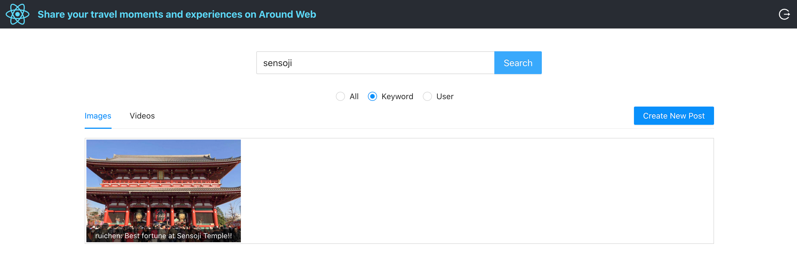

# Around
A Cloud and React based Social Network 

### Overview
Around is a full-stack web application for people to share photos/videos and publish posts.

### Demo Picture 1

### Demo Picture 2

### Project Architecture

### Tools and Technologies

* <strong>Front-end: </strong>React
* <strong>Back-end: </strong>Go
* <strong>Retrieving Posts: </strong>Elastic Search
* <strong>Authentication: </strong>Token-based authentication
* <strong>Deployment: </strong>AWS Amplify(Front-end), Google Cloud Engine(Back-end)

### Main Features
* Supports basic login/logout function flow with React Router v4 and server-side user authentication with JWT
* User-friendly webpages for users to create and browse posts and search other users' posts
* Supports searching posts based on keyword or username

### Extentions
* Polish the home webpage...
